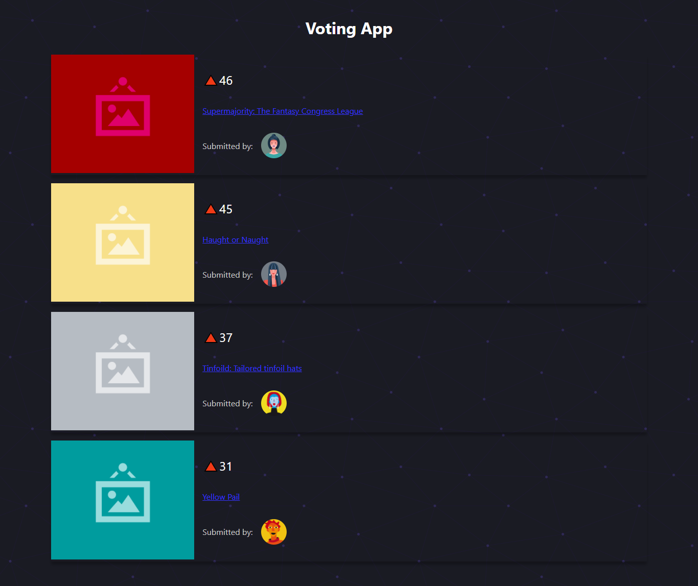

# Voting App

The #1 ReactJs App was bootstrapped with [create-react-app](https://create-react-app.dev/).
- Clone from [book-fullstack-react](https://github.com/johannlilly/book-fullstack-react/tree/master/exercise-files/voting_app).
- This demo app is a site like [Product Hunt](http://producthunt.com/) or [Reddit](http://reddit.com).

### 

## Running the app

1. Ensure you have `npm` installed.

Follow the instructions for your platform [here](https://github.com/npm/npm).

2. Install `http-server`

````
npm install
````

3. Boot the HTTP server

````
npm run server
````

The server is now running at [localhost:3000](localhost:3000)

